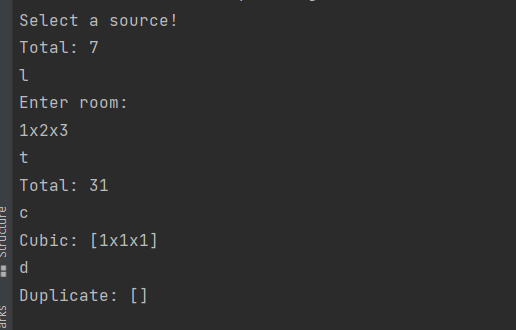

Console based application, not sure that it was a right decision

**Install:**

mvn or mvnw clean install

**Run:**
cd target

java -jar casablanca-wallpaper-1.0-SNAPSHOT.jar

**Possible commands:**

F - enter file name(path to file), sample-input.txt, for example

L - enter line (1x1x1)

T - total

C - cubic

D - duplicate

Q - exit

Example:

